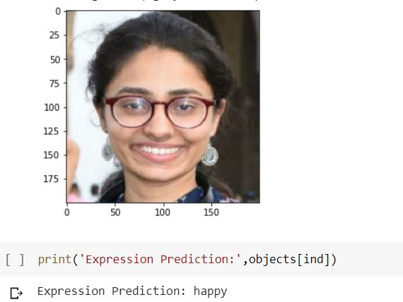

# Face-emotion-recognition
Convolutional Neural Network was applied on 36K observations to classify 7 facial expressions using ReLu and Softmax activations
A Deep Learning-Convolutional Neural Network Classifier to identify facial emotionA Deep Learning-Convolutional Neural Network Classifier to identify facial emotion
One test of this model is shown below

fer2013 data is used here to make the model. The data is collected from Kaggle : https://www.kaggle.com/ahmedmoorsy/facial-expression/download

This data was firstly used in a Kaggle Challenege :https://www.kaggle.com/c/challenges-in-representation-learning-facial-expression-recognition-challenge/data/ , where the winner got 71.2% test accuracy

Here in this model we got 66% test accuracy and 86% train accuracy with adam optimizer

Using GPU in google colab the whole project is done.
